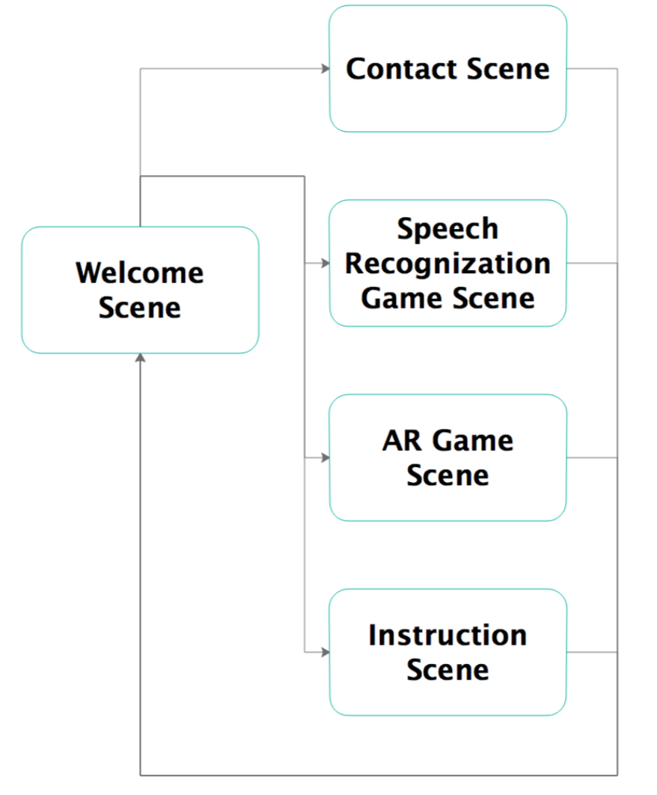
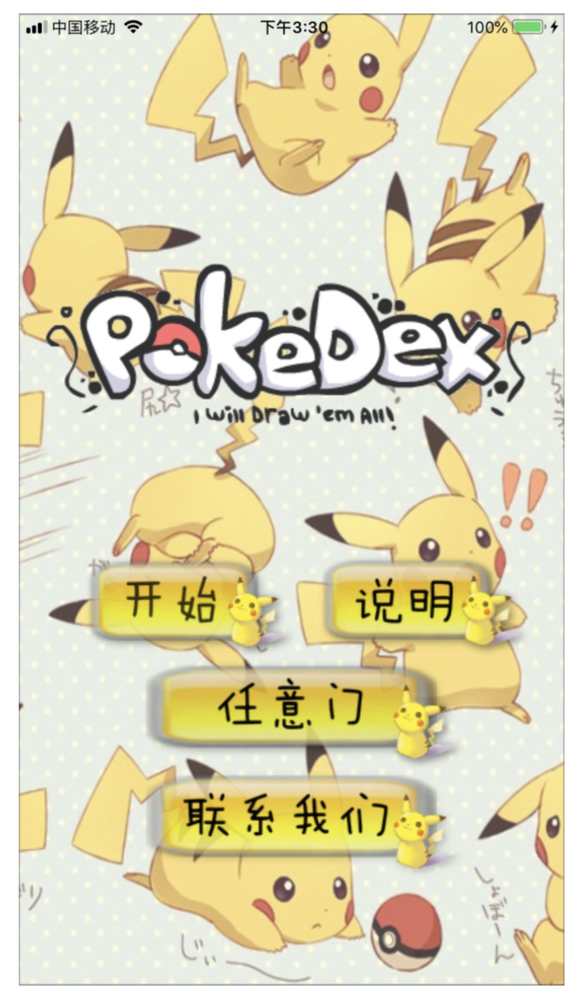

# Pokedex-pikachu
Speech recognization game (iOS application) with iflytek

## 1  Description

### 1.1 Project Introduction

Our project is called Pokedex, which is a pet game. The main technology it used is speech recognition and AR technology. In the game, the players can use the AR technology to find an “any door” on the plane and then enter the room and observe the Pikachu in all directions. They can also open the 2D edition to chat with Pikachu or give orders in the form of speak.

Here are its specific functions:

- Any door. You can find a plane in reality, place an “any door”, and observe Pikachu at a close distance.

- Voice wake-up. Pikachu begin to receive orders after identifying the specified keyword that users said.
- Chatting function. If the users say the specified keyword, Pikachu will make corresponding reply (within text, sound and action).
- Facelift function.   If Pikachu identify the user’s order to change its clothes, it will randomly dress up.
- Travelling function. If Pikachu identify the user’s order to travel, it will switch to the corresponding scene.
- Game function. If Pikachu identify the user’s order to play game, it will start the corresponding game (guess riddle and “tuwei” honey words).

### 1.2 Structures and Modules

The whole project uses Xcode to develop the MVC architecture on the iOS platform, but in fact, this game does not require too much data storage, so there are only two structures of V/C from the code file structure. The game  is  divided  into  two  parts: speech recognition game and AR experience game. Because of the use of storyboard development, all simple scene jump or button control does not need to create an additional controller, so the number of existing controller is less than the number of scene. As part of view is easy to understand, Tools relies heavily on many  external libraries, so the following section will focus on 2 controllers for corresponding 2 game scenes.

**(1)**     **Speech Recognition Game Scene:**

In this part, we use ifly MSC iOS SDK to help us for the speech wake up and speech recognition. The whole work flow for one certain speech wake-up is:

1. Create an IFlyVoiceWakeuper instance. 

1. Setting parameters.

1. Setting up the wake-up resource and starting the wake-up engine.

1. Start Wakeuper.

1. Audio uploads.

1. Check whether the current recording contains key words or not.

   1. If yes, wake-up succeeds. Call the callback function.

   1. If no, back to step 5.

According to our code, we will start a wakeuper first, and each time a key word is caught, the speech recognizer will be created to do the recognition job. The recognition result string will be stored in an array and be processed for certain condition. At the core, we do substring matching, to find some keywords and give feedback (Changing gif, playing audio and showing dialog bubble).

**(2)**      **AR Game Scene:**

And about the AR pika part, we use ARKit to complete the corresponding performance. Firstly, we set the configuration of world tracking and the plane detecting type. ARSCNView will add anchor when plane detected, and  call  didAdd⚓️ delegate function, so we can create and update the plane for the user.

Secondly, in order to achieve the effect that from  the outer of the room, we can just      see a door and cannot  see  the  walls,  we  need  to  set  the  rendering  order,  since  nodes with  greater  rendering  orders  are  rendered  last.  We  can  let  NodeA  to  be  transparent  and rendered first, so that the node rendered after NodeA will also be transparent.

Finally, we use Sky box effect to make the scene looks boundless. By the way, It's really hard to collect material for sky box, so we can only use mountain pictures to do that.

## 2 Operating

### 2.1 Implemented Requirements 

- **Hardware requirement:**
  - iPhone with iOS 10. x or latter

- **Developing environment:**
  -  Xcode 9 or latter

- **Related package imported:**
  -  iflyMSC iOS SDK

### 2.2 Operating Instructions

TIPS ①The players should wake up the Pikachu first each time you want to give out the next order.

②The orders can be identified only after the Pikachu’s voice bubble disappears.

③If you do not speak or your words cannot be identified for a period of time, it will say " 溜 了 ！" and you need to re-awaken Pikachu.

**2.2.1**   **Main** **Interface**

①Click " 开 始 " to get into the House of Pikachu

②Click "任意门" to experience the AR model

③Click "说明" to check the game’s specific instructions

④Click "联系我们" to get our contact information

**2.2.2**   **Home Scene**

<img src="screenshots/3.png" width="350px" />

①Say any one of （“早上好啊”，“中午好啊”，“下午好啊” ,“晚上好啊”）to wake up the Pikachu.

②After wake it up, you can talk with it. The chat keywords include

（“吃”，“开心”，“你真棒”，“你真菜”，“头发”）.

③After wake it up, you can give out dress up order, including

（“换装”，“木头人”, “游戏”）.

④After wake it up, you can give out travel order, including

（“去公园”，“去海边”）, then Pikachu will go to corresponding scene.

⑤After wake it up, you can give out game order, including

（“猜谜语”，“土味情话”）, then Pikachu will give you the question. You can try any times you want until you win. Or you can say“告诉我”or “不知道” to find the answer and stop the game.

**2.2.3**   **Park Scene**

①Say any one of （“早上好啊”，“中午好啊”，“下午好啊” , “晚上好啊”）to wake up the Pikachu.

②After wake it up, you can talk with it, the chat keywords include

（“高兴”，“累”，“学习”，“热”，“吃”）.

③After wake it up, you can give out dress up order, including

（“找朋友”，“飞”，“过节”,“跑”）.

④After wake it up, you can give out return order, then Pikachu will go home.

（“回家”）.

**2.2.4**   **Sea Scene**

①Say any one of （“早上好啊”，“中午好啊”，“下午好啊” , “晚上好啊”）to wake up the Pikachu.

②After wake it up, you can talk with it, the chat keywords include

（“晒”，“开心”，“渴”，“学习”，“椰子树”）.

③After wake it up, you can give out ‘change’ order, including

（“冲浪”，“戴帽子”）.

④After wake it up, you can give out return order, then Pikachu will go home.

（“回家”）.

**2.2.5**   **Any door** 

The player uses the camera and moves the mobile phone to find a right plane. Then you can place an AR “any door”. The outside is the real world. The inside is the Mountain View and Pikachu. You can go into the door and feel the mountains around you or observe Pikachu closely.

## 3 Comment

### 3.1 Advantages

① All the orders are given out by speaking, that makes the operation more convenient and interesting.

② Each instruction is equipped with special sound effects, which makes the game experience of player more comfortable.

③ The player can both see Pikachu in 2D mode and 3D mode, that makes the image of Pikachu more vivid.

④ As long as your words includes the key word, Pikachu can recognize your words. You can communicate with a lifelike Pikachu.

⑤ When Pikachu reply your order, it will make different sounds to express its feeling.

⑥ The interface seems pleasing and the operation is easy to learn, which has a strong interaction.

### 3.2 Disadvantages

① The giving of orders are not so smooth, players need to wait for a long time.

② Players cannot give out orders continuously , which still needs to be improved.

③ The whole game picture style is not so unified, that still need to improve.

④ The “any door” function should recognize a plane, but the plane is so difficult to find that it takes a lot of time.

### 3.3 Difficulties

① We need to learn to use completely unfamiliar development platforms （iOS）  and integration packages （Speech Recognition SDK）, which is  really  confusing and troublesome.

② AR material is hard to find, especially 3D modeling material.

③ There are few .png pictures that can be used in this project, and there are few scene pictures that match the image of Pikachu. 

## 4 Improvement

① We should solve the problem that the game cannot manage continuous orders.

② We should make the interface looks more wonderful.

③ Improve the recognition of the plane, or only recognize a point to put the “any door”.

④ The updated version can be a networking one. In this way, we can add a social function part in our game.

⑤ For game design part, we should have more orders to offer abundant interaction.